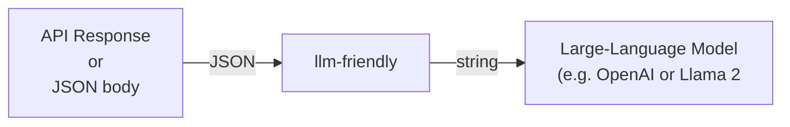

# llm-friendly

`llm-friendly` converts API responses to LLM-friendly text.



## Currently Supported Source APIs

 - Amazon Web Services (AWS)
   - Textract

[//]: # ( - Azure AI)

[//]: # (   - Vision)

[//]: # ( - Google Cloud Platform &#40;GCP&#41;)

[//]: # (   - Vision)

## Installation

```shell
pip install git+https://github.com/GovTechSG/llm-friendly.git
```

## Usage

```python
from llm_friendly.aws import textract

textract_response = {...}
text_content = textract.to_llm_output(textract_response)
print(text_content)
```

## Tests

```shell
pytest
```