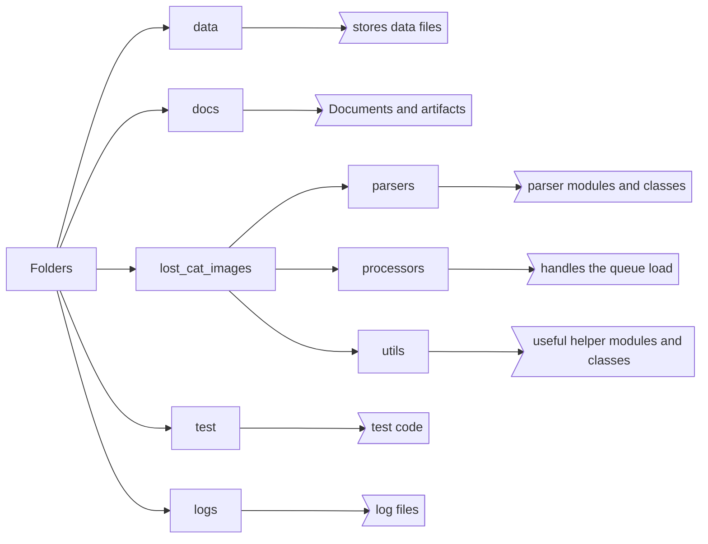

# lost cat image library
used to collect the image processing libraries together



## build

`build.bat` will build the library and will push to the PyPi Test and Main Repos, comment out the relevant lines, the PyPi upload expects the `.pypirc` file to be located in the `%users folder%\%username%` folder.

```Batchfile
:: upload the package to pypi
:: https://packaging.python.org/en/latest/tutorials/packaging-projects/
python -m pip install --upgrade build
python -m build

:: test the package
::python -m twine upload --repository testpypi dist/*
::python -m pip install --index-url https://test.pypi.org/simple/ --no-deps lost_cat_medical

:: upload to pypi
python -m twine upload --repository pypi dist/*
python -m pip install --upgrade lost_cat_images
```

## running tests
`python -m unittest discover test`

The results are output to the screen, and a log file is created for each unittest, `\logs`
The source data for the test are in the `\data` folder
